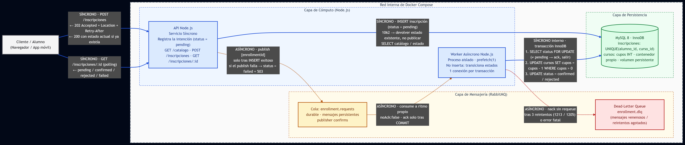

# Entrega 1 — Propuesta de Arquitectura

**Programación Distribuida y Componentes · Proyecto Final**
**Módulo 1 — Introducción a la programación distribuida**

| | |
|---|---|
| **Grupo N°** | 15 |
| **Integrantes** | Jonathan Mora Colodrero, Maria Constanza Gigli |
| **Temática** | 7. Plataforma de e-learning — Motor transaccional de inscripciones de alta concurrencia |
| **Repositorio** | https://github.com/JoniMora/final-pdc |
| **Área / Sector** | EdTech / Educación |
| **Tag / Release** | `v1-propuesta-arquitectura` |
| **Fecha de entrega** | 06/09/2026 |

---

## 1. Introducción: el problema

Toda plataforma educativa con cupos limitados vive el mismo momento crítico: la apertura del período de inscripción. Durante días no pasa nada y, a la hora señalada, miles de alumnos intentan inscribirse en los mismos cursos en el mismo minuto. Es un **pico masivo de carga concurrente** (*flash crowd*), y el caso local más conocido es el de los sistemas de inscripción universitaria como **SIU Guaraní**, cuya saturación en cada inicio de cuatrimestre es un problema recurrente para los estudiantes argentinos.

Una arquitectura síncrona tradicional falla exactamente ahí. Cada `POST /inscripciones` abre una conexión a la base de datos, lee el cupo disponible, lo compara y escribe. Con miles de peticiones simultáneas sobre **la misma fila** (el cupo de un curso), la base de datos se convierte en el cuello de botella: las conexiones se agotan, los tiempos de respuesta crecen hasta el timeout, el usuario reintenta y multiplica la carga, y el sistema termina cayendo. Peor aún: entre la lectura del cupo y la escritura pueden colarse otras peticiones, y el sistema asigna **más cupos de los que existen** (*overbooking*) o inscribe dos veces a la misma persona.

El sistema que proponemos es un **motor transaccional de inscripciones** para una plataforma de e-learning, destinado a **alumnos** (se inscriben y consultan el resultado) y **administradores académicos** (definen cursos y cupos). Su objetivo no es tener más funcionalidades que un CRUD, sino resolver bien un solo problema difícil: **absorber picos masivos de inscripciones sin saturar la base de datos, garantizando que nunca se asignen más cupos que los disponibles ni se inscriba dos veces al mismo alumno.**

## 2. La solución: serializar con una cola de mensajes

El patrón aplicado es **Queue-Based Load Leveling**. La idea central es separar la parte de la petición que puede ser rápida y paralela (registrar que un alumno *quiere* inscribirse) de la parte que es contenciosa y debe ser secuencial (decidir si *obtiene* el cupo).

1. **La API registra la intención y responde de inmediato.** Al recibir el `POST`, la API inserta la inscripción en estado `pending` (una fila nueva por alumno: sin contención) y publica un evento en la cola de RabbitMQ. Responde `202 Accepted` con la URL donde el alumno puede consultar el resultado. Este paso tarda milisegundos y escala horizontalmente.
2. **La cola actúa como amortiguador.** Diez mil peticiones que llegan en un segundo quedan encoladas de forma durable, en orden de llegada. La base de datos nunca ve el pico: ve un flujo constante a la velocidad que el worker puede procesar.
3. **El worker decide de a una.** Un proceso independiente consume los mensajes con `prefetch(1)` y, dentro de una transacción InnoDB, descuenta el cupo con un `UPDATE cursos SET cupos = cupos - 1 WHERE id = ? AND cupos > 0`. Si el `UPDATE` afecta una fila, hay cupo y la inscripción pasa a `confirmed`; si afecta cero filas, pasa a `rejected`. La operación es atómica: la base de datos garantiza que no hay *overbooking*, sin necesidad de lógica de bloqueo en Node.js.
4. **El alumno consulta el resultado** con `GET /inscripciones/:id` (*polling* con `Retry-After`), y recibe `pending`, `confirmed`, `rejected` o `failed`.

Dos garantías adicionales que el diseño resuelve explícitamente:

- **Idempotencia.** RabbitMQ puede reentregar un mensaje si el worker muere antes de confirmar (`ack`). Para no descontar dos veces el cupo, el worker primero verifica bajo bloqueo de fila (`SELECT ... FOR UPDATE`) que la inscripción siga en `pending`; si ya fue procesada, confirma el mensaje y no hace nada. La restricción `UNIQUE (alumno_id, curso_id)` impide, a su vez, que un doble clic genere dos inscripciones.
- **Tolerancia a fallos.** Cola y mensajes durables (sobreviven a un reinicio del broker), confirmación de publicación (*publisher confirms*), reintentos acotados y una *dead-letter queue* para mensajes que no pueden procesarse, y `ack` solo después del `COMMIT`.

## 3. Modelo 4+1 de Kruchten

### 3.1 Vista Lógica

Entidades principales del dominio:

- **Alumno**: identidad del usuario que se inscribe.
- **Curso**: oferta académica con `cupos` disponibles, actualizados de forma atómica.
- **Inscripción**: relación Alumno–Curso con ciclo de vida `pending → confirmed | rejected | failed` y restricción de unicidad `(alumno_id, curso_id)`.

Un Alumno se inscribe en muchos Cursos a través de Inscripción; un Curso tiene muchas Inscripciones.

### 3.2 Vista de Desarrollo

Monorepo Node.js con dos servicios desacoplados que comparten el esquema de datos:

```
final-pdc/
├── api/          # Servicio HTTP síncrono: catálogo, registro de intención, consulta de estado
├── worker/       # Consumidor asíncrono: validación y asignación de cupo
├── shared/
│   ├── db/       # Acceso a MySQL (mysql2) y migraciones
│   └── messaging/# Cliente RabbitMQ (amqplib), colas y DLQ
├── docker-compose.yml
└── docs/         # Documentación por entrega
```

### 3.3 Vista de Procesos

El punto de concurrencia es el **descuento simultáneo de cupos de un mismo curso** por miles de alumnos. Se resuelve con Queue-Based Load Leveling: la API encola la intención y responde `202`; el worker consume de a un mensaje y descuenta el cupo con un `UPDATE` condicional atómico dentro de una transacción InnoDB. La idempotencia ante reentregas se garantiza verificando el estado de la inscripción bajo bloqueo de fila, y el orden fijo de adquisición de bloqueos (`inscripciones` → `cursos`) evita *deadlocks* entre workers.

### 3.4 Vista Física

Un host de despliegue con cuatro contenedores en una red interna de Docker Compose:

| Contenedor | Rol | Expone al exterior |
|---|---|---|
| `api` (Node.js) | Servicio HTTP síncrono | Sí (puerto HTTP) |
| `rabbitmq` | Message broker: cola principal y DLQ | No |
| `worker` (Node.js) | Consumidor asíncrono | No |
| `mysql` (MySQL 8 / InnoDB) | Persistencia, volumen propio | No |

El cliente (navegador o app) queda fuera de la red. API y Worker se comunican únicamente a través del broker; ambos acceden a la base de datos. Cada contenedor puede escalarse de forma independiente.

### 3.5 Escenarios (+1): «Apertura de inscripciones a un curso con cupo limitado»

- **Lógica:** un Alumno solicita una Inscripción a un Curso con 10 cupos.
- **Desarrollo:** el módulo `api` registra la Inscripción en estado `pending` y publica el evento; el módulo `worker` lo consume.
- **Procesos:** 500 solicitudes concurrentes se serializan en la cola; el worker descuenta el cupo atómicamente y marca `confirmed` (10 inscripciones) o `rejected` (490).
- **Física:** la petición entra por el contenedor `api`, transita por `rabbitmq`, la procesa `worker` y persiste en `mysql`; el alumno consulta el resultado por *polling* al endpoint de estado.

Este escenario será, además, la prueba de carga de las próximas entregas: el criterio de aceptación es **exactamente 10 confirmados, 0 duplicados, 0 cupos negativos**.

## 4. Diagrama de despliegue



Fuente del diagrama en [`arquitectura.mmd`](./arquitectura.mmd). Convenciones: líneas continuas = comunicación síncrona; líneas punteadas = asíncrona; azul = cómputo, ámbar = mensajería, verde = persistencia, rojo = dead-letter queue.

```mermaid
%%{init: {"theme":"base","themeVariables":{"fontSize":"14px","primaryTextColor":"#F4F4F5","lineColor":"#52525B","titleColor":"#334155","clusterBkg":"#FAFAFA","clusterBorder":"#334155","edgeLabelBackground":"#4B4B4B"},"flowchart":{"curve":"basis","nodeSpacing":40,"rankSpacing":70}}}%%
flowchart LR
    %% ============================================================
    %%  Motor Transaccional de E-learning de Alta Concurrencia
    %%  Patrón: Queue-Based Load Leveling (absorción de picos de carga)
    %% ============================================================

    Cliente["Cliente / Alumno<br/>(Navegador / App móvil)"]

    subgraph Docker["Red Interna de Docker Compose"]

        subgraph Compute["Capa de Cómputo (Node.js)"]
            API["API Node.js<br/>Servicio Síncrono<br/>Registra la intención (status = pending)<br/>GET /catalogo · POST /inscripciones · GET /inscripciones/:id"]
            Worker["Worker Asíncrono Node.js<br/>Proceso aislado · prefetch(1)<br/>No inserta: transiciona estados<br/>1 conexión por transacción"]
        end

        subgraph Queue["Capa de Mensajería (RabbitMQ)"]
            MQ["Cola: enrollment.requests<br/>durable · mensajes persistentes<br/>publisher confirms"]
            DLQ["Dead-Letter Queue<br/>enrollment.dlq<br/>(mensajes venenosos / reintentos agotados)"]
        end

        subgraph Persist["Capa de Persistencia"]
            DB[("MySQL 8 · InnoDB<br/>inscripciones: UNIQUE(alumno_id, curso_id)<br/>cursos: cupos INT · contenedor propio · volumen persistente")]
        end

    end

    %% ----------------------- Flujos -----------------------------
    Cliente -->|"SÍNCRONO · POST /inscripciones<br/>← 202 Accepted + Location + Retry-After<br/>← 200 con estado actual si ya existía"| API
    Cliente -->|"SÍNCRONO · GET /inscripciones/:id (polling)<br/>← pending / confirmed / rejected / failed"| API
    API -->|"SÍNCRONO · INSERT inscripción (status = pending)<br/>1062 → devolver estado existente, no publicar<br/>SELECT catálogo / estado"| DB
    API -.->|"ASÍNCRONO · publish {enrollmentId}<br/>solo tras INSERT exitoso<br/>si el publish falla → status = failed + 503"| MQ
    MQ -.->|"ASÍNCRONO · consume a ritmo propio<br/>noAck:false · ack solo tras COMMIT"| Worker
    Worker -->|"SÍNCRONO interno · transacción InnoDB<br/>1. SELECT status FOR UPDATE (≠ pending → ack, salir)<br/>2. UPDATE cursos SET cupos = cupos - 1 WHERE cupos > 0<br/>3. UPDATE status = confirmed / rejected"| DB
    Worker -.->|"ASÍNCRONO · nack sin requeue<br/>tras 3 reintentos (1213 / 1205) o error fatal"| DLQ

    %% ----------------------- Estilos ----------------------------
    classDef actor   fill:#F4F4F5,stroke:#52525B,stroke-width:2px,color:#18181B
    classDef compute fill:#DBEAFE,stroke:#1D4ED8,stroke-width:2px,color:#1E3A8A
    classDef queue   fill:#FEF3C7,stroke:#B45309,stroke-width:2px,color:#78350F
    classDef dlq     fill:#FEE2E2,stroke:#B91C1C,stroke-width:2px,color:#7F1D1D
    classDef persist fill:#DCFCE7,stroke:#15803D,stroke-width:2px,color:#14532D

    class Cliente actor
    class API,Worker compute
    class MQ queue
    class DLQ dlq
    class DB persist

    style Docker  fill:#FAFAFA,stroke:#334155,stroke-width:2px,stroke-dasharray: 8 4
    style Compute fill:#EFF6FF,stroke:#1D4ED8,stroke-width:1px,stroke-dasharray: 4 3
    style Queue   fill:#FFFBEB,stroke:#B45309,stroke-width:1px,stroke-dasharray: 4 3
    style Persist fill:#F0FDF4,stroke:#15803D,stroke-width:1px,stroke-dasharray: 4 3

    %% Flechas síncronas (azul) vs asíncronas (ámbar) vs DLQ (rojo)
    linkStyle 0,1,2,5 stroke:#1D4ED8,stroke-width:2px
    linkStyle 3,4     stroke:#B45309,stroke-width:2px
    linkStyle 6       stroke:#B91C1C,stroke-width:2px
```



## 5. Stack tecnológico

| Componente | Tecnología | Motivo |
|---|---|---|
| API y Worker | Node.js (Express / amqplib / mysql2) | Un solo lenguaje para ambos servicios; I/O no bloqueante adecuado para alta concurrencia |
| Message broker | RabbitMQ | Colas durables, `ack` manual, `prefetch`, DLQ nativa; panel de administración para observar la cola durante la prueba de carga |
| Base de datos | MySQL 8 (InnoDB) | Transacciones ACID, bloqueo de fila, restricción `UNIQUE` |
| Orquestación | Docker Compose | Reproduce el despliegue de cuatro contenedores en cualquier máquina con un comando |

## 6. Contenido de esta carpeta

- `informe.md` — este documento.
- `arquitectura.mmd` — fuente Mermaid del diagrama de despliegue.
- `arquitectura.png` — diagrama exportado (infografía técnica).
- `presentacion.pdf` — presentación de tres diapositivas.
