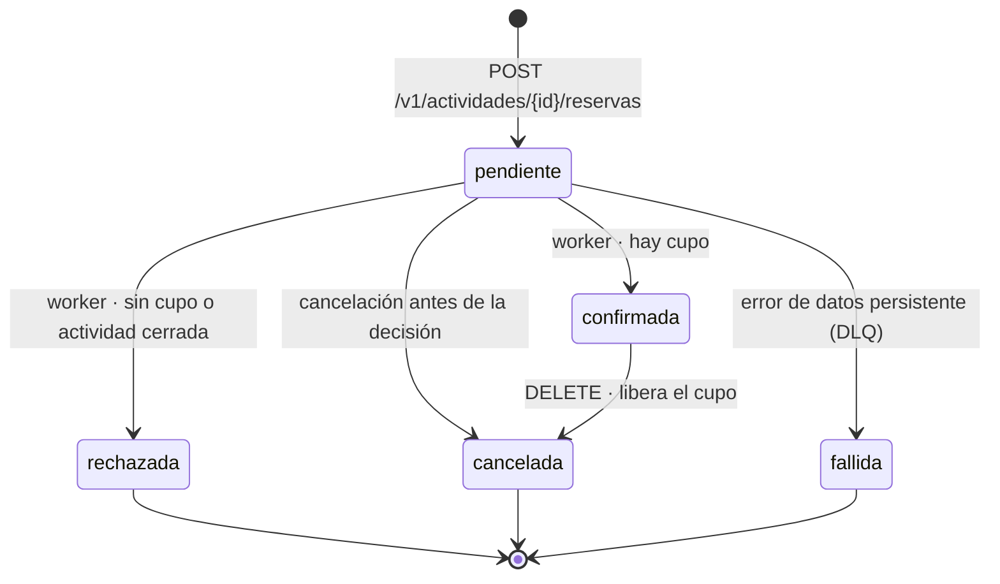

# Entrega 1 — Propuesta de Arquitectura

**Programación Distribuida y Componentes · Proyecto Final**
**Módulo 1 — Introducción a la programación distribuida**

| | |
|---|---|
| **Grupo N°** | 15 |
| **Integrantes** | Jonathan Mora Colodrero, María Constanza Gigli |
| **Temática** | 7. Plataforma de e-learning — generalizada a un servicio multi-tenant de reserva de cupos; la plataforma de e-learning es el cliente de referencia |
| **Título** | Servicio multi-tenant de reserva de cupos: alta concurrencia y continuidad operativa para los sistemas consumidores |
| **Repositorio** | https://github.com/JoniMora/final-pdc |
| **Área / Sector** | Software como servicio (SaaS) de reservas y gestión de cupos · caso de referencia: EdTech |
| **Tag / Release** | `v1.2-propuesta-arquitectura` (original: `v1-propuesta-arquitectura`) |
| **Fecha de entrega** | 06/09/2026 |
| **Revisión 1** | 17/09/2026 — persistencia primario-réplica con replicación semi-sincrónica: el nodo único de MySQL era un punto único de falla. |
| **Revisión 2** | 22/09/2026 — ampliación de alcance a pedido de la cátedra: API pública multi-tenant para cualquier dominio con cupo y continuidad operativa de los sistemas consumidores ante la caída de su propia base de datos. |

---

## 1. Introducción

### 1.1 El problema

Toda actividad con cupo limitado —una materia, un partido de fútbol 5, un asado entre amigos, un turno— enfrenta el mismo momento crítico cuando la demanda llega junta: muchas solicitudes compiten por pocos lugares en el mismo instante (*flash crowd*). El caso local más conocido es la apertura de inscripciones universitarias en sistemas como SIU Guaraní. Una implementación síncrona ingenua lee el cupo, lo compara y escribe sobre la misma fila; bajo concurrencia, las conexiones se agotan, la latencia crece hasta el timeout, el usuario reintenta y multiplica la carga, y entre la lectura y la escritura se cuelan otras peticiones: el sistema asigna más lugares de los que existen (*overbooking*) o registra dos veces a la misma persona.

A ese problema de concurrencia se suma uno de fragilidad. Cada organización que gestiona cupos reimplementa esta lógica sobre su propia base de datos, y si esa base cae pierde, justo en el momento de mayor demanda, el registro de quién está inscripto.

### 1.2 Evolución del alcance

La propuesta original (06/09/2026) resolvía el primer problema para un único dominio: la inscripción a cursos de una plataforma de e-learning. La revisión del 17/09/2026 eliminó el punto único de falla de la persistencia. En la presentación, la cátedra consideró el alcance insuficiente para evaluar los módulos del programa y pidió dos ampliaciones: ofrecer el servicio como una API pública que cualquier sistema pueda consumir para cualquier dominio con cupo, y que el servicio sirva de respaldo a los sistemas consumidores cuando su propia infraestructura falle.

La primera ampliación se adopta sin cambios en el núcleo: el problema de concurrencia es independiente del dominio. La segunda exige precisar qué significa "respaldo". **El servicio no aloja, replica ni respalda bases de datos de terceros**: no conoce sus esquemas, no tiene acceso a ellas y ellas no tienen acceso a la suya. Lo que sí hace es ser la **fuente de verdad** del estado de las actividades y reservas de cada consumidor, incluidos los datos opacos que éste decide adjuntarles, y exponer ese estado de forma completa, paginada y ordenada. Con eso, un consumidor cuya base cae puede seguir operando en **modo contingencia** contra la API y, al recuperarse, **reconciliar** su estado leyendo los cambios ocurridos desde su último punto de control. La plataforma de e-learning del diseño original pasa a ser el primer consumidor: el **cliente de referencia** que demuestra ese comportamiento.

## 2. La solución

### 2.1 Un servicio para cualquier dominio: API pública multi-tenant

Cada organización consumidora es un **tenant** que se autentica con su propia clave de API. El dominio se reduce a lo que todos los casos comparten: una **actividad** tiene una capacidad y cupos disponibles; una **reserva** asigna un cupo a un **participante**, identificado por un valor opaco del sistema del tenant. Todo lo demás —el nombre de la materia, la cancha del partido, quién lleva el carbón— viaja en un campo `metadata` de tipo JSON que el servicio **almacena y devuelve sin interpretar** (hasta 16 KB, validado sólo en tamaño y sintaxis). El servicio funciona "sin importar el JSON" por construcción: no hay esquema del consumidor que conocer, sólo un contrato HTTP.

El contrato (sección 4) sigue convenciones difundidas en APIs públicas: versionado en la ruta (`/v1`), errores como *Problem Details* (RFC 9457), respuestas `202 Accepted` con `Location` para operaciones asíncronas y la cabecera `Idempotency-Key`, obligatoria al crear reservas, para que un consumidor que no recibió la respuesta (timeout, corte de red) pueda reintentar sin riesgo de duplicar.

### 2.2 Nivelación de carga: la decisión contenciosa, de a una

El patrón central se mantiene: **Queue-Based Load Leveling**. La admisión —registrar que un participante *quiere* un cupo— es rápida y paralela: una fila nueva por solicitud, sin contención. La decisión —si lo *obtiene*— es contenciosa: todas las solicitudes de una actividad compiten por la misma fila. Por eso se separan. La API registra la reserva en estado `pendiente` y responde `202`; la decisión la toma un **worker** que consume comandos de una cola de RabbitMQ de a uno (`prefetch(1)`) y descuenta el cupo con una única sentencia condicional dentro de una transacción InnoDB:

```sql
UPDATE actividades
   SET cupos_disponibles = cupos_disponibles - 1
 WHERE id = ? AND estado = 'abierta' AND cupos_disponibles > 0;
```

Una fila afectada: la reserva pasa a `confirmada`. Cero filas: pasa a `rechazada`. La garantía de no sobreasignación la da la base de datos, no la lógica de aplicación, y se refuerza con la restricción `CHECK (cupos_disponibles BETWEEN 0 AND capacidad)`. La cancelación de una reserva confirmada recorre el mismo camino con signo contrario: el contador de cupos sólo lo modifica el worker, y esa invariante está impuesta por privilegios de columna de MySQL (sección 2.7), no por la disciplina del equipo.

### 2.3 Un único registro de cambios: outbox transaccional, feed y auditoría

Un sistema que escribe en una base de datos y además publica en un broker enfrenta el problema de la **doble escritura**: si el proceso cae entre ambas operaciones, queda un cambio sin mensaje o un mensaje sin cambio. El diseño original lo mitigaba parcialmente con *publisher confirms*. Para una API pública se resuelve de raíz con el patrón **Transactional Outbox**: ni la API ni el worker publican en RabbitMQ. Cada cambio de estado se escribe **en la misma transacción** junto con una fila en la tabla `cambios`, que contiene el tipo de cambio y una instantánea completa de la entidad con su número de versión. Un proceso independiente, el **relay**, es el único que lee esa tabla y publica. Cumple dos funciones separadas, de modo que la caída del broker no detiene la primera:

1. **Secuenciador del feed.** Asigna a cada cambio un número de secuencia creciente. Como es la única instancia que asigna secuencias y lo hace en transacciones serializadas, la secuencia visible es densa y respeta el orden de confirmación: un lector que ya vio la secuencia *n* nunca verá aparecer después una menor. Así se evita el defecto clásico de usar un autoincremental como cursor, en el que una transacción lenta confirma un número menor cuando el lector ya avanzó.
2. **Publicador.** Publica los cambios secuenciados con *publisher confirms* y los marca como publicados: los comandos (`reservar`, `cancelar`) hacia la cola del worker y las notificaciones (`reserva.confirmada`, `reserva.rechazada`, `reserva.cancelada`) hacia la cola de webhooks. Si cae entre publicar y marcar, republica: la entrega es **al-menos-una-vez**, y todos los consumidores son idempotentes. Ambas propiedades juntas dan un **efecto exactamente-una-vez** sobre el estado.

Como red de seguridad, un **barredor** periódico vuelve a publicar el comando de las reservas que siguen `pendientes` después de varios minutos, sólo cuando las colas de comandos están vacías: si no hay trabajo encolado y hay reservas pendientes, sus comandos se perdieron, por ejemplo por la pérdida del volumen del broker. La idempotencia del worker hace segura esa republicación.

La tabla `cambios` cumple así tres funciones con una sola escritura: es el **outbox** del sistema, el **feed de reconciliación** que consumen los tenants (`GET /v1/cambios`) y el **registro de auditoría** de cada reserva.

### 2.4 Notificaciones: webhooks firmados con entrega al-menos-una-vez

Un tenant puede registrar una URL de webhook. El **notificador** consume la cola de notificaciones y hace un `POST` a esa URL por cada cambio. Cada envío se firma con HMAC-SHA256 sobre la marca de tiempo y el cuerpo, con un secreto propio del tenant (`X-Firma: t=<unix>,v1=<hex>`); el receptor verifica la firma y descarta mensajes de más de cinco minutos de antigüedad, lo que impide la falsificación y la reinyección (*replay*). Si el receptor no responde `2xx` dentro del plazo, el mensaje pasa por colas de espera con TTL escalonado (10 s, 1 min, 5 min) que lo devuelven a la cola de entregas; agotados los intentos, va a `webhooks.dlq`. Esa dead-letter queue **no implica pérdida de información**: el webhook es un mecanismo de baja latencia, no de garantía; la garantía la da el feed, del que el tenant siempre puede leer lo que no recibió. Cada notificación lleva la secuencia y la versión de la entidad, de modo que el receptor descarta duplicados y cambios más viejos que los que ya aplicó.

### 2.5 Continuidad operativa del tenant: fuente de verdad, contingencia y reconciliación

La respuesta al pedido de "respaldo" es un contrato de tres piezas que el cliente de referencia implementa y demuestra:

- **Operación normal.** El tenant solicita reservas por la API y mantiene su propia base actualizada con los webhooks (o sondeando el feed), guardando la última secuencia aplicada como punto de control.
- **Modo contingencia.** Si su base de datos falla, su aplicación no se detiene: lee el estado vigente desde el servicio (`GET /v1/actividades/{id}` y `GET /v1/actividades/{id}/reservas`, paginado por cursor), incluidos los datos opacos que había adjuntado, y sigue solicitando reservas por la API, que nunca dependió de su base. Los webhooks que no puede procesar quedan en reintento.
- **Reconciliación.** Al recuperarse, lee `GET /v1/cambios?desde=<punto de control>` y aplica cada cambio sólo si su versión es mayor que la que tiene. Como cada cambio trae la instantánea completa de la entidad, aplicarlo dos veces o fuera de orden no altera el resultado: el estado del tenant converge al del servicio.

El límite es explícito: el servicio es fuente de verdad **de las reservas y de lo que el tenant adjunta a ellas**, no de su sistema completo. Si el tenant necesita operar en contingencia con otros datos, debe incluirlos en `metadata`. Si lo que cae es el servidor completo del tenant, el servicio conserva todo y el feed reconstruye el estado cuando vuelve.

### 2.6 Alta disponibilidad en la persistencia

La capa de persistencia es un esquema **primario-réplica**: `mysql-primary` recibe todas las escrituras y lecturas; `mysql-replica`, en modo `super_read_only`, mantiene una copia y actúa como nodo de contingencia. El nodo único del diseño inicial era el único componente cuya caída detenía a la vez la admisión y la asignación de cupos y exponía a perder las últimas transacciones confirmadas; un servicio que se ofrece como fuente de verdad de terceros no puede tener su dato en un punto único de falla.

La replicación es **semi-sincrónica** en modo `AFTER_SYNC`: el primario no devuelve el `COMMIT` al cliente hasta que la réplica acusa haber recibido y persistido la transacción en su *relay log*. Toda reserva cuya confirmación el worker recibió —y recién entonces confirmó el mensaje a RabbitMQ— existe en dos nodos: el objetivo de punto de recuperación (RPO) para lo confirmado es cero. Si la réplica no responde dentro de `rpl_semi_sync_source_timeout`, MySQL degrada a replicación asíncrona para no bloquear al primario; ese cambio se monitorea (`Rpl_semi_sync_source_status`) y se registra como incidente, porque durante esa ventana vuelve a existir exposición a la pérdida del último commit.

El failover es **manual**. Mientras el primario está caído, la API responde `503 Service Unavailable` con `Retry-After`: no puede admitir sin persistir, y aceptar sin persistir reintroduciría la carrera entre el `202` y la primera consulta. El worker y el relay distinguen errores de infraestructura de errores de datos y, ante los primeros, pausan sin consumir reintentos ni derivar mensajes a la DLQ; RabbitMQ y el outbox retienen el trabajo pendiente. Cuando un administrador promueve la réplica (`STOP REPLICA; SET GLOBAL super_read_only = OFF`) y redirige el pool de conexiones de los servicios por variable de entorno, el procesamiento se reanuda. La reanudación es segura por la idempotencia del worker: una transacción confirmada antes de la caída ya está en el nodo promovido, y el `SELECT … FOR UPDATE` la encuentra fuera de `pendiente`. Las lecturas se mantienen en el primario: leer de la réplica rompería la lectura de las propias escrituras, porque un consumidor que recibe el `202` y consulta de inmediato podría no encontrar su reserva. La automatización de la promoción queda como trabajo futuro.

### 2.7 Seguridad

Una API pública convierte la seguridad en parte del núcleo:

- **Autenticación por clave.** Cada tenant recibe una clave aleatoria de 256 bits, mostrada una sola vez, que presenta como `Authorization: Bearer`. La base guarda un prefijo identificable y el hash SHA-256 de la clave. Un hash rápido es adecuado aquí: a diferencia de una contraseña, una clave con 256 bits de entropía no es atacable por diccionario, y verificarla en cada solicitud no tiene costo apreciable.
- **Aislamiento entre tenants.** El `tenant_id` se deriva siempre de la clave, nunca de la ruta ni del cuerpo, y toda consulta lo incluye como condición. Un recurso de otro tenant responde `404`, no `403`, para no revelar su existencia.
- **Límite de tasa por tenant.** Protege la admisión del abuso de un consumidor sobre los demás (*noisy neighbor*) y responde `429` con `Retry-After`.
- **Mínimo privilegio en la base.** Cada componente usa un usuario MySQL propio. La API puede insertar reservas y cambios y actualizar el estado de sus actividades, pero no el contador de cupos: sólo el usuario del worker tiene `UPDATE (cupos_disponibles)` sobre `actividades`. La invariante "un único camino de escritura del cupo" queda impuesta por la base.
- **Integridad de los webhooks.** Firma HMAC-SHA256 con marca de tiempo y ventana de cinco minutos contra la reinyección (sección 2.4).
- **Webhooks sin SSRF.** La URL la elige el tenant y el notificador está conectado a la red interna: sin control, un tenant podría registrar `http://rabbitmq:15672` o `http://mysql-primary:3306` y usar al servicio para atacarse a sí mismo (*server-side request forgery*). Al registrar la URL y antes de cada envío, el notificador resuelve el host y rechaza direcciones privadas, de *loopback* y nombres de servicios internos; en el entorno local sólo se admite una lista explícita de hosts permitidos (el cliente de referencia).
- **Higiene general.** Consultas siempre parametrizadas, secretos por variables de entorno, límite de tamaño de `metadata` y redes de Docker separadas (sección 3.4). En el entorno local la comunicación es HTTP sobre una red simulada; en producción, TLS lo termina el balanceador (fuera de alcance).

## 3. Modelo 4+1 de Kruchten

### 3.1 Vista lógica

| Entidad | Atributos principales | Reglas |
|---|---|---|
| **Tenant** | nombre, prefijo y hash de la clave, URL y secreto de webhook | Toda otra entidad pertenece a exactamente un tenant |
| **Actividad** | capacidad, cupos disponibles, estado (`abierta` / `cerrada`), `metadata` JSON, versión | `0 ≤ cupos_disponibles ≤ capacidad` (restricción `CHECK`) |
| **Reserva** | actividad, participante (identificador opaco del tenant), estado, motivo, versión, clave de idempotencia, `metadata` JSON | A lo sumo una reserva activa (`pendiente` o `confirmada`) por participante y actividad; clave de idempotencia única por tenant |
| **Cambio** | secuencia, entidad, tipo, instantánea JSON con versión, fecha de publicación | Se escribe en la misma transacción que el cambio que registra; su contenido nunca se modifica |

Un tenant tiene muchas actividades; una actividad, muchas reservas; cada actividad y cada reserva, muchos cambios. Los identificadores son UUIDv7 (RFC 9562): al estar ordenados por tiempo no degradan el índice agrupado de InnoDB como lo harían inserciones aleatorias, y permiten paginar por cursor en orden de creación. La unicidad de la reserva *activa* se implementa con una columna generada que vale `1` en los estados activos y `NULL` en los demás, incluida en un índice único: como MySQL admite múltiples `NULL` en un índice único, un participante rechazado o cancelado puede volver a solicitar, pero nunca tener dos reservas activas en la misma actividad.

Ciclo de vida de una reserva:



### 3.2 Vista de desarrollo

Monorepo Node.js con cuatro servicios desacoplados que comparten el esquema de datos y el contrato:

```
final-pdc/
├── servicios/
│   ├── api/            # API pública v1: autenticación, admisión, consultas, listado y feed
│   ├── relay/          # Outbox: secuenciador del feed, publicador y barredor
│   ├── worker/         # Comandos reservar y cancelar: asignación atómica de cupos
│   └── notificador/    # Webhooks firmados con reintentos escalonados
├── compartido/
│   ├── db/             # Pool mysql2, migraciones, usuarios y privilegios por componente
│   ├── mensajeria/     # amqplib: exchanges, colas, esperas y DLQ
│   └── contrato/       # openapi.yaml (fuente del contrato) y esquemas
├── clientes/
│   └── aula/           # Cliente de referencia: e-learning mínimo con PostgreSQL propio
├── pruebas/
│   ├── carga/          # k6: actividad caliente y escenario multi-tenant
│   └── fallos/         # Guiones de inyección de fallos (sección 5)
├── docker-compose.yml
└── docs/               # Documentación por entrega
```

El contrato `openapi.yaml` es la fuente de verdad de la interfaz: la API valida contra él y el cliente de referencia se construye a partir de él. Los dos puntos de integración entre las líneas de trabajo del equipo son el esquema de la tabla `cambios` y el contrato del webhook.

### 3.3 Vista de procesos

| Punto de concurrencia o sincronización | Riesgo | Mecanismo |
|---|---|---|
| Cupo de una actividad bajo un pico | Sobreasignación; contención sobre una fila | Cola de comandos, worker con `prefetch(1)` y `UPDATE` condicional atómico |
| Base de datos y broker | Doble escritura: cambio sin mensaje o mensaje sin cambio | Outbox transaccional; sólo el relay publica |
| Feed de cambios | Huecos: el lector avanza antes de que confirme una transacción lenta | Relay como secuenciador único en transacciones serializadas |
| Reentrega de mensajes | Descontar dos veces un cupo | Verificación del estado bajo `SELECT … FOR UPDATE`; versión en webhooks y feed |
| Reintento HTTP del tenant | Reserva duplicada | `Idempotency-Key`: misma clave y cuerpo → misma reserva (`200`); otro cuerpo → `422` |
| Reserva y cancelación concurrentes | Cupo liberado dos veces o nunca | Máquina de estados bajo el mismo bloqueo de fila; orden fijo de bloqueos (`reservas` → `actividades`) contra *deadlocks* |
| Caída de la base de datos | Vaciar la cola hacia la DLQ | Clasificación de errores: infraestructura → reencolar y pausar; datos → reintentos acotados, DLQ y estado `fallida` |
| Escalado | Contención entre workers sobre la misma actividad | Particionado por actividad con un exchange de hash consistente: un consumidor por partición, orden por actividad y paralelismo entre actividades |

Con una sola partición, el rendimiento sobre una actividad "caliente" está acotado por la serialización sobre su fila. El particionado no mejora ese caso —ninguna arquitectura decide en paralelo sobre un mismo contador sin coordinación— pero sí escala el caso multi-tenant, en el que muchas actividades reciben demanda a la vez. Ambos casos se miden por separado en la Entrega 6.

### 3.4 Vista física

Un host con nueve contenedores en tres redes de Docker. Siete forman el servicio; dos simulan un sistema consumidor independiente.

| Contenedor | Rol | Redes | Expone |
|---|---|---|---|
| `api` | API pública v1 | pública, interna | Sí (HTTP) |
| `relay` | Outbox: secuenciador del feed, publicador y barredor | interna | No |
| `worker` | Asignación de cupos | interna | No |
| `notificador` | Webhooks salientes | interna, pública | No |
| `rabbitmq` | Comandos, notificaciones, esperas y DLQ | interna | No |
| `mysql-primary` | Persistencia: escrituras y lecturas; binlog + GTID | interna | No |
| `mysql-replica` | Réplica semi-sincrónica en `super_read_only` | interna | No |
| `aula` | Cliente de referencia: plataforma de e-learning mínima | pública, tenant | Sí (web) |
| `aula-db` | Base propia del cliente (PostgreSQL) | tenant | No |

La red `publica` simula internet: sólo la atraviesan la API, el notificador y los consumidores. La red `interna` contiene el broker y las bases del servicio; la red `tenant` es privada del cliente. **Ningún consumidor tiene ruta de red hacia la base del servicio ni el servicio hacia la del consumidor**: la única interfaz entre ambos es HTTP, en los dos sentidos (API y webhooks). Que el cliente de referencia use PostgreSQL y un modelo de datos propio demuestra que el servicio no impone motor ni esquema. Todos los componentes del servicio escalan horizontalmente salvo el primario, único por definición, y el relay, instancia única por diseño (sección 8).

### 3.5 Escenario (+1): apertura de una materia de 10 cupos con la base del cliente caída

- **Lógica:** el tenant *Aula* crea una Actividad (una materia de 10 cupos); 500 alumnos solicitan una Reserva.
- **Desarrollo:** `clientes/aula` invoca `servicios/api`; `relay`, `worker` y `notificador` procesan los cambios.
- **Procesos:** cada una de las 500 admisiones inserta su reserva `pendiente` y su cambio en una transacción y responde `202`; el relay secuencia y publica los 500 comandos; el worker confirma 10 y rechaza 490; el notificador envía los webhooks.
- **Física:** a mitad de la ráfaga se detiene `aula-db`. Aula pasa a modo contingencia: muestra los inscriptos leyendo el listado de la API y sigue admitiendo por la API; los webhooks que no puede procesar quedan en espera. Al volver `aula-db`, Aula consume `/v1/cambios` desde su último punto de control.

Criterio de aceptación: **exactamente 10 confirmadas, 0 duplicadas, 0 cupos negativos**, y al finalizar la base de Aula coincide con el estado del servicio. Es también la demostración de la defensa final.

## 4. Contrato de la API (v1)

Todas las rutas exigen `Authorization: Bearer <clave del tenant>`; los errores se devuelven como `application/problem+json` (RFC 9457).

| Método y ruta | Propósito | Respuestas principales |
|---|---|---|
| `POST /v1/actividades` | Crear una actividad con cupo (materia, partido, asado) | `201` · `400` · `429` |
| `GET /v1/actividades/{id}` | Consultar la actividad y sus cupos disponibles | `200` · `404` |
| `PATCH /v1/actividades/{id}` | Abrir o cerrar la admisión | `200` · `404` |
| `POST /v1/actividades/{id}/reservas` | Solicitar una reserva; exige `Idempotency-Key` | `202` + `Location` · `200` (repetición idempotente) · `409` (reserva activa o actividad cerrada) · `422` (clave reutilizada con otro cuerpo) · `429` · `503` + `Retry-After` |
| `GET /v1/reservas/{id}` | Consultar el estado de una reserva | `200` (+ `Retry-After` si está pendiente) · `404` |
| `DELETE /v1/reservas/{id}` | Solicitar la cancelación; libera el cupo si estaba confirmada | `202` · `404` · `409` |
| `GET /v1/actividades/{id}/reservas?estado=&cursor=&limite=` | Listado paginado por cursor: operación en contingencia | `200` |
| `GET /v1/cambios?desde=&limite=` | Feed de cambios del tenant en orden de secuencia: reconciliación | `200` |

**Webhook.** `POST` a la URL registrada por el tenant, con las cabeceras `X-Firma: t=<unix>,v1=<HMAC-SHA256(secreto, t + "." + cuerpo)>` y `X-Cambio-Secuencia`, y un cuerpo con la misma forma que un elemento del feed. El receptor responde `2xx` en menos de cinco segundos o el envío se reintenta.

```json
{
  "secuencia": 1042,
  "tipo": "reserva.confirmada",
  "ocurrido_en": "2026-11-10T14:03:22.118Z",
  "entidad": {
    "id": "0199a1c2-4f3b-7d21-8e6a-3b5c9d0e1f24",
    "actividad_id": "0199a1b8-02e4-7c55-9a10-6d7e8f901a2b",
    "participante": "alumno-38112",
    "estado": "confirmada",
    "version": 2,
    "metadata": { "nombre": "Ana Pérez", "comision": "B" }
  }
}
```

## 5. Matriz de fallos

Cada fila es un escenario de la Entrega 5 (`pruebas/fallos/`).

| Componente que falla | Efecto inmediato | Qué se garantiza | Recuperación |
|---|---|---|---|
| `api` | No se admiten solicitudes nuevas | Lo admitido ya está en la base; el tenant reintenta con la misma `Idempotency-Key` sin duplicar | Reinicio automático |
| `relay` | La admisión continúa; no se publican comandos ni notificaciones; el feed no avanza | El outbox retiene todos los cambios, en orden | Al reiniciar, secuencia y publica lo pendiente |
| `rabbitmq` | La admisión continúa; el relay reintenta; worker y notificador esperan | Los mensajes encolados son durables; lo no publicado sigue en el outbox; el barredor cubre la pérdida del volumen | Reinicio del broker |
| `worker` | Los comandos se acumulan en la cola | Los mensajes sin `ack` se reentregan; la verificación de estado evita el doble descuento | Reinicio |
| `notificador` | Webhooks demorados | Cola de entregas durable; el feed sigue disponible | Reinicio |
| `mysql-primary` | La API responde `503` + `Retry-After`; relay y worker pausan | RPO = 0 para lo confirmado; el trabajo pendiente queda en la cola y el outbox | Promoción manual de la réplica y redirección del pool; RTO medido en la Entrega 5 |
| `mysql-replica` | El primario continúa; vencido el timeout, la replicación degrada a asíncrona | Servicio sin interrupción; la ventana de exposición se registra como incidente | Reconstrucción de la réplica |
| Base del tenant (`aula-db`) | El tenant no puede leer su estado local ni procesar webhooks | Contingencia contra la API; webhooks en reintento; feed completo | Reconciliación desde el último punto de control |
| Servidor completo del tenant | Webhooks fallidos; agotados, van a `webhooks.dlq` | El servicio conserva todo el estado; ningún cambio se pierde | El tenant reconstruye su estado desde el feed |

## 6. Diagrama de despliegue


Fuente en [`arquitectura.mmd`](./arquitectura.mmd). Convenciones: líneas continuas = comunicación síncrona; punteadas = asíncrona; azul = cómputo, ámbar = mensajería, verde = persistencia (la réplica con borde discontinuo), rojo = dead-letter queues, gris = sistemas de los tenants.

```mermaid
%%{init: {"theme":"base","themeVariables":{"fontSize":"14px","primaryTextColor":"#F4F4F5","lineColor":"#52525B","titleColor":"#334155","clusterBkg":"#FAFAFA","clusterBorder":"#334155","edgeLabelBackground":"#4B4B4B"},"flowchart":{"curve":"basis","nodeSpacing":40,"rankSpacing":70}}}%%
flowchart LR
    %% ============================================================
    %%  Servicio multi-tenant de reserva de cupos
    %%  Queue-Based Load Leveling · Transactional Outbox · Primario-Réplica
    %%  Revisión 2 · 22/09/2026
    %% ============================================================

    subgraph Tenant["Tenant de referencia · red propia"]
        Aula["Aula · e-learning (Node.js)<br/>usa su propia base (aula-db)<br/>modo contingencia · receptor de webhooks<br/>reconciliación por feed"]
        AulaDB[("aula-db · PostgreSQL<br/>base propia del tenant")]
    end

    Otros["Otros tenants<br/>liga de fútbol · asado · pruebas k6"]

    subgraph Servicio["Servicio · Docker Compose · 7 contenedores · red interna"]

        API["API pública v1 (Node.js)<br/>Bearer · aislamiento por tenant · límite de tasa<br/>Idempotency-Key · 202 + Location<br/>listado paginado · feed /v1/cambios"]
        Relay["Relay (Node.js)<br/>secuenciador del feed · publicador<br/>barredor de pendientes"]
        Cmd["RabbitMQ · reservas.comandos<br/>durable · hash por actividad"]
        Ent["RabbitMQ · webhooks.entregas<br/>esperas TTL: 10 s · 1 min · 5 min"]
        Worker["Worker (Node.js)<br/>prefetch(1) · cupo atómico<br/>idempotente · clasifica errores"]
        Notif["Notificador (Node.js)<br/>webhooks HMAC-SHA256<br/>reintentos escalonados"]
        DLQ["RabbitMQ · reservas.dlq · webhooks.dlq"]

        subgraph Persistencia["Persistencia (primario-réplica)"]
            DBP[("mysql-primary · MySQL 8 · InnoDB<br/>tenants · actividades · reservas<br/>cambios = outbox + feed + auditoría")]
            DBR[("mysql-replica · MySQL 8<br/>super_read_only · contingencia")]
        end
    end

    %% ----------------------- Flujos -----------------------------
    Aula -->|"SÍNCRONO · HTTP · Bearer<br/>reservas · listado · GET /v1/cambios?desde="| API
    Otros -->|"SÍNCRONO · HTTP · Bearer<br/>POST reservas (Idempotency-Key)"| API
    API -->|"SÍNCRONO · TX: INSERT reserva (pendiente)<br/>+ INSERT cambio → 202<br/>503 + Retry-After si el primario no responde"| DBP
    DBP -->|"SÍNCRONO · el relay sondea cambios nuevos<br/>asigna secuencia · marca publicados"| Relay
    Relay -.->|"ASÍNCRONO · comandos<br/>publisher confirms"| Cmd
    Relay -.->|"ASÍNCRONO · notificaciones"| Ent
    Cmd -.->|"ASÍNCRONO · ack tras COMMIT<br/>BD caída: requeue + pausa"| Worker
    Worker -->|"SÍNCRONO · TX: SELECT … FOR UPDATE<br/>UPDATE cupos WHERE cupos > 0<br/>estado + versión + cambio"| DBP
    Worker -.->|"errores de datos"| DLQ
    Ent -.->|"ASÍNCRONO · consume"| Notif
    Notif -.->|"reintentos agotados"| DLQ
    Notif -.->|"POST webhook firmado<br/>al-menos-una-vez"| Aula
    DBP -.->|"semi-sincrónica AFTER_SYNC<br/>RPO = 0 para lo confirmado"| DBR
    Aula -->|"SÍNCRONO · su propio esquema"| AulaDB

    %% ----------------------- Estilos ----------------------------
    classDef tenant  fill:#F4F4F5,stroke:#52525B,stroke-width:2px,color:#18181B
    classDef compute fill:#DBEAFE,stroke:#1D4ED8,stroke-width:2px,color:#1E3A8A
    classDef queue   fill:#FEF3C7,stroke:#B45309,stroke-width:2px,color:#78350F
    classDef dlq     fill:#FEE2E2,stroke:#B91C1C,stroke-width:2px,color:#7F1D1D
    classDef primary fill:#DCFCE7,stroke:#15803D,stroke-width:2px,color:#14532D
    classDef replica fill:#F0FDF4,stroke:#15803D,stroke-width:2px,stroke-dasharray: 5 3,color:#14532D

    class Otros,Aula,AulaDB tenant
    class API,Relay,Worker,Notif compute
    class Cmd,Ent queue
    class DLQ dlq
    class DBP primary
    class DBR replica

    style Servicio     fill:#FAFAFA,stroke:#334155,stroke-width:2px,stroke-dasharray: 8 4
    style Tenant       fill:#FAFAFA,stroke:#52525B,stroke-width:2px,stroke-dasharray: 8 4
    style Persistencia fill:#F0FDF4,stroke:#15803D,stroke-width:1px,stroke-dasharray: 4 3

    %% Síncrono (azul) · asíncrono (ámbar) · DLQ (rojo) · replicación (verde)
    linkStyle 0,1,2,3,7,13 stroke:#1D4ED8,stroke-width:2px
    linkStyle 4,5,6,9,11  stroke:#B45309,stroke-width:2px
    linkStyle 8,10        stroke:#B91C1C,stroke-width:2px
    linkStyle 12          stroke:#15803D,stroke-width:2px
```



## 7. Stack tecnológico

| Componente | Tecnología | Motivo |
|---|---|---|
| API, relay, worker y notificador | Node.js (Express, mysql2, amqplib) | Un lenguaje para los cuatro servicios; E/S no bloqueante |
| Contrato | OpenAPI 3.1 | Contrato verificable y documentación generada |
| Broker | RabbitMQ con el plugin de exchange de hash consistente | Colas durables, `ack` manual, `prefetch`, TTL y *dead-lettering* nativos; particionado por clave |
| Base del servicio | MySQL 8 (InnoDB), primario + réplica semi-sincrónica | Transacciones ACID, bloqueo de fila, `CHECK`, columnas generadas, privilegios por columna, replicación sin pérdida de lo confirmado |
| Cliente de referencia | Node.js + PostgreSQL | Demuestra independencia de motor y de esquema |
| Pruebas de carga | k6 | Escenarios concurrentes reproducibles y métricas de latencia |
| Orquestación | Docker Compose | Nueve contenedores y tres redes reproducibles con un comando |

## 8. Alcance, límites declarados y prioridades

**Núcleo comprometido.** API multi-tenant con autenticación, aislamiento e `Idempotency-Key`; outbox y relay; worker con asignación atómica e idempotente; listado y feed de cambios; primario-réplica semi-sincrónico con failover manual; cliente de referencia con modo contingencia y reconciliación; prueba de aceptación 10 / 0 / 0.

**Extensiones, en orden de recorte si el calendario lo exige.** (1) Particionado por actividad: la Entrega 6 mediría entonces el límite de un solo worker. (2) Límite de tasa por tenant. (3) Reintentos escalonados de webhooks, que se reemplazarían por un intervalo fijo. (4) Webhooks: el tenant sondearía el feed. El orden prioriza lo que prueba las garantías sobre lo que mejora la experiencia.

**Límites declarados.** Relay de instancia única: su caída demora pero no pierde; un relevo en espera con `GET_LOCK` es trabajo opcional. Failover manual. Degradación a replicación asíncrona si vence el timeout de la réplica. Límite de tasa por instancia de la API: con N instancias, el límite efectivo se multiplica por N. Webhooks al-menos-una-vez: el receptor deduplica. `metadata` opaca de hasta 16 KB, sin búsquedas por su contenido. Un único host.

**Fuera de alcance.** Alojar, replicar o respaldar bases de datos de los tenants; alta de tenants autoservicio (se crean con un script de administración); autenticación de los usuarios finales del tenant (el participante es un identificador opaco); listas de espera; modificación de la capacidad de una actividad; pagos; TLS en el entorno local; cifrado en reposo. Los datos personales que un tenant incluya en `metadata` son responsabilidad del tenant en los términos de la Ley 25.326; el servicio los trata como opacos.

## 9. Contenido de esta carpeta

- `informe.md` — este documento.
- `arquitectura.mmd` — fuente Mermaid del diagrama de despliegue.
- `arquitectura.png` — diagrama exportado.
- `presentacion.pdf` — presentación de tres diapositivas.
- `Entrega1-Propuesta-Arquitectura.pdf` — certificación de la entrega.
